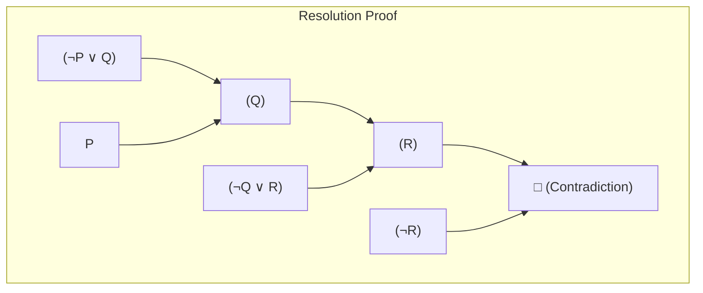
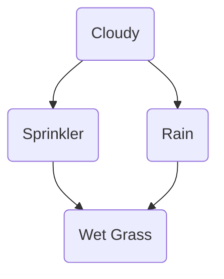

# Artificial Intelligence - UT-2 Question Bank Solutions

This repository contains solutions to the question bank for the second unit test in Artificial Intelligence, as per the Mumbai University curriculum. Each answer is structured to meet the requirements of a 5-mark question.

---

### [cite_start]1. Forward and Backward Chaining [cite: 2]

**Chaining** refers to an inference process that uses a set of logical rules to derive new information from known facts. It is a fundamental component of inference engines in rule-based expert systems.

#### Forward Chaining (Data-Driven) 🧠
Forward chaining is a "data-driven" reasoning process. It starts with the available **known facts** in the knowledge base. It then applies inference rules to these facts to derive new facts. This process continues iteratively until the desired goal is reached or no more new facts can be derived.

* **Process:** Starts with facts and moves *forward* to the conclusion.
* **Best Use Case:** When you have new facts and want to see what conclusions can be drawn, such as in monitoring or control systems.

**Example:**
* **Knowledge Base (Rules):**
    * R1: **IF** it is raining ($A$) **THEN** the ground is wet ($B$). ($A \implies B$)
    * R2: **IF** the ground is wet ($B$) **THEN** the grass is slippery ($C$). ($B \implies C$)
* **Known Fact:** It is raining ($A$).
* **Inference Steps:**
    1.  The system starts with fact $A$ ("it is raining").
    2.  Rule R1 ($A \implies B$) matches fact $A$. The system infers a new fact: $B$ ("the ground is wet").
    3.  The system now has facts {$A, B$}. Rule R2 ($B \implies C$) matches the new fact $B$.
    4.  The system infers another new fact: $C$ ("the grass is slippery").
    5.  **Conclusion:** The grass is slippery.

#### Backward Chaining (Goal-Driven) 🎯
Backward chaining is a "goal-driven" reasoning process. It starts with a **hypothetical goal** (something to be proven) and works backward. It looks for rules that could have led to this goal. It then tries to prove the antecedents (the 'IF' parts) of those rules, which now become new sub-goals.

* **Process:** Starts with a goal and works *backward* to find supporting facts.
* **Best Use Case:** When you have a specific hypothesis to test, such as in diagnostic or advisory systems.

**Example:**
* **Knowledge Base (Rules):**
    * R1: **IF** it is raining ($A$) **THEN** the ground is wet ($B$). ($A \implies B$)
    * R2: **IF** the ground is wet ($B$) **THEN** the grass is slippery ($C$). ($B \implies C$)
* **Goal:** Is the grass slippery? (Prove $C$).
* **Inference Steps:**
    1.  The system starts with the goal: $C$.
    2.  It finds Rule R2, which concludes $C$. To prove $C$, it must now prove the premise of R2, which is $B$ ("the ground is wet"). $B$ becomes the new sub-goal.
    3.  To prove sub-goal $B$, it finds Rule R1, which concludes $B$. To prove $B$, it must now prove the premise of R1, which is $A$ ("it is raining"). $A$ becomes the new sub-goal.
    4.  The system checks the knowledge base for the fact $A$. If $A$ is present (or the user confirms it), the chain of reasoning is validated.
    5.  **Conclusion:** Since $A$ is a known fact, $B$ is proven, and therefore $C$ is proven. The grass is slippery.

---

### [cite_start]2. Resolution Tree [cite: 3]

**Resolution** is a rule of inference used for automated theorem proving. The goal is to prove a proposition by showing that its negation leads to a contradiction. This is done by converting all facts into Conjunctive Normal Form (CNF) and repeatedly applying the resolution rule.

**Example Problem:**
* **Facts:** $P \implies Q$, $Q \implies R$, $P$.
* **Prove:** $R$.
* **CNF Clauses:** $\{\neg P \lor Q, \neg Q \lor R, P, \neg R\}$ (with negated goal)

**Resolution Tree:**
The process involves resolving pairs of clauses to derive new ones, aiming for an empty clause (contradiction).

1.  Resolve $(\neg P \lor Q)$ and $(P)$ to derive $(Q)$.
2.  Resolve $(Q)$ and $(\neg Q \lor R)$ to derive $(R)$.
3.  Resolve $(R)$ and $(\neg R)$ (from the negated goal) to derive the **empty clause (□)**.

Since we found a contradiction, the original goal ($R$) is proven to be true.

---

### [cite_start]3. Propositional Logic to CNF Conversion [cite: 4]

**Conjunctive Normal Form (CNF)** is a standard form for logical statements where the statement is expressed as a conjunction (ANDs) of one or more clauses, and each clause is a disjunction (ORs) of literals.

**Steps for Conversion:**
1.  **Eliminate Biconditionals (⇔):** Replace $A \iff B$ with $(A \implies B) \land (B \implies A)$.
2.  **Eliminate Implications (⇒):** Replace $A \implies B$ with $\neg A \lor B$.
3.  **Move Negation Inwards (NNF):** Use De Morgan's laws and double negation to move any $\neg$ signs so they only apply to single variables.
    * $\neg (A \land B) \equiv \neg A \lor \neg B$
    * $\neg (A \lor B) \equiv \neg A \land \neg B$
    * $\neg (\neg A) \equiv A$
4.  **Distribute Disjunction (OR) over Conjunction (AND):** Apply the distributive law.
    * $A \lor (B \land C) \equiv (A \lor B) \land (A \lor C)$

**Example:**
Convert the statement $A \implies (B \iff C)$ to CNF.

* **Step 1: Eliminate Biconditional (⇔)**
    $A \implies ((B \implies C) \land (C \implies B))$

* **Step 2: Eliminate Implications (⇒)**
    $\neg A \lor ((\neg B \lor C) \land (\neg C \lor B))$

* **Step 3: Move Negation Inwards**
    (Not needed in this example)

* **Step 4: Distribute OR over AND**
    $(\neg A \lor (\neg B \lor C)) \land (\neg A \lor (\neg C \lor B))$

The final statement in **CNF** is: $(\neg A \lor \neg B \lor C) \land (\neg A \lor \neg C \lor B)$.

---

### [cite_start]4. Convert Facts into FOPL [cite: 5]

**First-Order Predicate Logic (FOPL)** is an extension of propositional logic that allows for reasoning about objects and their relations. It uses quantifiers ($\forall$ for all, $\exists$ for there exists) and predicates.

**Example Facts and their FOPL Conversion:**

1.  **Fact:** "Every student loves AI."
    * **FOPL:** $\forall x (\text{Student}(x) \implies \text{Loves}(x, \text{AI}))$

2.  **Fact:** "Some students are intelligent."
    * **FOPL:** $\exists x (\text{Student}(x) \land \text{Intelligent}(x))$

3.  **Fact:** "All programmers use a computer."
    * **FOPL:** $\forall x (\text{Programmer}(x) \implies \exists y (\text{Computer}(y) \land \text{Uses}(x, y)))$

4.  **Fact:** "Brothers are siblings."
    * **FOPL:** $\forall x \forall y (\text{Brother}(x, y) \implies \text{Sibling}(x, y))$

---

### [cite_start]5. Knowledge Representation Techniques [cite: 6]

**Knowledge Representation (KR)** is the field of AI dedicated to representing information about the world in a form that a computer can use.

1.  **Logical Representation:**
    * Uses formal logic (Propositional and First-Order Logic) to represent knowledge with precise semantics and sound inference rules.

2.  **Semantic Networks:**
    * A graph-based representation with **nodes** for objects/concepts and **arcs** for relationships (e.g., "is-a", "has-part"). It's intuitive and supports inheritance.

3.  **Frames:**
    * A data structure representing a concept using **slots** to hold information. It organizes knowledge in bundles, allowing for default values and inheritance.

4.  **Production Rules (Rule-Based Systems):**
    * Represents knowledge as a set of **IF-THEN** rules. This is a modular and easy-to-understand method that forms the backbone of most expert systems.

---

### [cite_start]6. Prior and Posterior Probability [cite: 7]

**Prior Probability** and **Posterior Probability** are core concepts in Bayesian statistics for updating beliefs with new evidence.

#### Prior Probability: $P(H)$
The **prior probability** is the initial probability of a hypothesis ($H$) *before* considering any new evidence. It's your initial belief.

* **Example:** The probability that a random person has a rare disease (e.g., 1 in 10,000) is a **prior probability**. $P(\text{Disease}) = 0.0001$.

#### Posterior Probability: $P(H|E)$
The **posterior probability** is the updated probability of the hypothesis ($H$) *after* considering new evidence ($E$).

* **Example:** After the person tests positive for the disease, the probability that they actually have it is a **posterior probability**. It is calculated using Bayes' theorem by combining the prior probability with the evidence from the test result.

---

### [cite_start]7. Bayesian Belief Networks (BBN) [cite: 8]

A **Bayesian Belief Network (BBN)** is a probabilistic graphical model that represents variables and their dependencies using a **Directed Acyclic Graph (DAG)**.

**Key Components:**
* **Nodes:** Represent random variables.
* **Edges:** Represent conditional dependencies (A -> B means A directly influences B).
* **Conditional Probability Table (CPT):** Each node has a CPT that quantifies its probability distribution given its parents.

**Example: The Wet Grass Problem**
The grass can be wet (W) if the sprinkler was on (S) or if it was raining (R). Cloudy (C) weather makes rain more likely but makes using the sprinkler less likely.

**DAG Representation:**

Each node in this graph would have a CPT. For example, the CPT for Wet Grass, P(W | S, R), would define the probability of the grass being wet for all possible combinations of Sprinkler and Rain states.

---

### [cite_start]8. Bayes' Theorem [cite: 9]

**Bayes' Theorem** is a mathematical formula for determining conditional probability. It describes the probability of an event based on prior knowledge of related conditions.

**The Formula:**
$$P(A|B) = \frac{P(B|A) \cdot P(A)}{P(B)}$$

* $P(A|B)$: **Posterior Probability** (probability of A given B)
* $P(B|A)$: **Likelihood** (probability of B given A)
* $P(A)$: **Prior Probability** (initial probability of A)
* $P(B)$: **Evidence** (total probability of B)

**Example: Medical Diagnosis**
If a disease affects 1% of people ($P(A) = 0.01$) and a test for it is 99% accurate ($P(B|A) = 0.99$) with a 5% false positive rate ($P(B|\neg A) = 0.05$), the probability of having the disease given a positive test ($P(A|B)$) is calculated.

$$P(A|B) = \frac{0.99 \cdot 0.01}{(0.99 \cdot 0.01) + (0.05 \cdot 0.99)} \approx 0.167 \text{ or } 16.7\%$$
This shows that even with a positive test, the chance of having the disease is low because it's a rare disease.

---

### [cite_start]9. Solved Sum using Conditional probability / Bayes' theorem [cite: 10]

**Problem:**
A factory has two machines, X and Y. Machine X produces 60% of the output, and Y produces 40%. The defect rate for X is 2%, and for Y is 5%. If an item is found to be defective, what is the probability it came from Machine Y?

**Solution:**
* **Events:** $X$ (from Machine X), $Y$ (from Machine Y), $D$ (defective).
* **Given:** $P(X) = 0.60$, $P(Y) = 0.40$, $P(D|X) = 0.02$, $P(D|Y) = 0.05$.
* **Goal:** Find $P(Y|D)$.

**Step 1: Calculate the total probability of a defect, $P(D)$.**
$P(D) = P(D|X)P(X) + P(D|Y)P(Y)$
$P(D) = (0.02 \cdot 0.60) + (0.05 \cdot 0.40) = 0.012 + 0.020 = 0.032$

**Step 2: Apply Bayes' Theorem.**
$$P(Y|D) = \frac{P(D|Y) \cdot P(Y)}{P(D)} = \frac{0.05 \cdot 0.40}{0.032} = \frac{0.020}{0.032} = 0.625$$

**Answer:** There is a **62.5%** probability that the defective item came from Machine Y.

---

### [cite_start]10. Architecture of an Expert System [cite: 11]

An **Expert System** is an AI program that emulates the decision-making ability of a human expert in a specific domain.

**Core Components:**
1.  **Knowledge Base:** The repository of domain-specific facts and rules (IF-THEN).
2.  **Inference Engine:** The "brain" of the system. It applies logical rules from the knowledge base to the facts of the current problem using methods like forward and backward chaining.
3.  **Working Memory:** A temporary database of facts related to the current problem.
4.  **User Interface:** Allows a non-expert user to interact with the system.
5.  **Explanation Facility:** Explains the system's reasoning to the user.
6.  **Knowledge Acquisition Facility:** Allows experts to update the knowledge base.

---

### [cite_start]11. Total Order vs. Partial Order Planning [cite: 12]

#### Total-Order Planning
A planner that creates a **strictly ordered sequence of actions**. The output is a linear plan where the order of every action is fixed.

* **Approach:** Searches through the space of states.
* **Drawback:** Inefficient as it commits to an order for all actions, even independent ones ("least commitment" is not followed).

#### Partial-Order Planning
A planner that creates a flexible plan by only ordering actions when necessary.

* **Approach:** Searches through the space of plans, not states. It adds actions and ordering constraints as needed to resolve conflicts or satisfy preconditions.
* **Advantage:** More efficient and flexible. It delays ordering decisions ("least commitment").
* **Example:** A plan to get dressed. `Sock on` must come before `Shoe on` for the same foot, but the plan doesn't need to specify whether to dress the left or right foot first.

---

### [cite_start]12. Different Types of Learning in AI [cite: 13]

1.  **Supervised Learning:**
    * Learns from **labeled data** to make predictions. The algorithm learns a mapping from input to output.
    * **Tasks:** Classification, Regression.
    * **Analogy:** A student learning with a teacher's guidance.

2.  **Unsupervised Learning:**
    * Learns from **unlabeled data** to find hidden patterns or structures.
    * **Tasks:** Clustering, Association.
    * **Analogy:** A researcher finding patterns in data without a hypothesis.

3.  **Reinforcement Learning:**
    * An **agent** learns by interacting with an **environment**. It performs actions and receives **rewards** or **penalties**, learning a policy to maximize cumulative rewards.
    * **Tasks:** Game playing, robotics.
    * **Analogy:** Training a pet with treats and scolding.

---

### [cite_start]13. Differentiate between Supervised and Unsupervised Learning [cite: 14]

| Feature         | Supervised Learning ✅                                       | Unsupervised Learning ❓                                  |
| :-------------- | :----------------------------------------------------------- | :---------------------------------------------------------- |
| **Input Data** | Uses **labeled data** (input-output pairs).                  | Uses **unlabeled data** (only inputs).                      |
| **Goal** | To **predict** an outcome.                                   | To **discover** hidden patterns.                            |
| **Approach** | **Supervised** and guided by the correct answers.            | **Un-guided**; the model finds structure on its own.         |
| **Feedback** | Direct feedback by comparing predictions to true labels.     | No direct feedback; success is often subjective.            |
| **Common Tasks** | **Classification** and **Regression**.                       | **Clustering** and **Association**.                         |
| **Algorithms** | Linear Regression, SVM, Decision Trees.                    | K-Means Clustering, PCA, Apriori.                           |

# Expert System Architecture 🤖

An **Expert System (ES)** is an AI program designed to mimic the decision-making ability of a human expert. It solves problems in a specific domain using a structured knowledge base and inference rules.

---

## 1️⃣ Key Components of an Expert System

An Expert System has five main components:

| Component                       | Function                                                                                                 |
| ------------------------------- | -------------------------------------------------------------------------------------------------------- |
| **Knowledge Base** | Stores facts and rules about the domain. Example: “If symptom = fever, then disease = flu.”                |
| **Inference Engine** | The brain of the system. Applies logical reasoning to the knowledge base to derive new facts or decisions. |
| **User Interface** | Allows interaction with users. Users input queries and receive advice.                                   |
| **Explanation Subsystem** | Explains how a conclusion was reached, increasing trust and transparency.                                |
| **Knowledge Acquisition Subsystem** | Helps update or add new knowledge from human experts or other sources.                                   |

---
---

## 3️⃣ How it Works (Step by Step)

1.  **User Input**: A user enters a query through the user interface (e.g., “What disease does this patient have based on these symptoms?”).
2.  **Inference Engine**: The engine searches the knowledge base using reasoning techniques like **forward chaining** (data-driven) or **backward chaining** (goal-driven).
3.  **Knowledge Base**: Provides the relevant facts and rules needed to analyze the problem.
4.  **Explanation Subsystem**: If requested, it details the "why" and "how" behind the conclusion, tracing the rules that were triggered.
5.  **Knowledge Acquisition**: The knowledge base is updated or expanded over time with new expert knowledge to improve its accuracy and scope.

---

## 4️⃣ Example: Medical Diagnosis Expert System 🩺

-   **Knowledge Base**: Contains rules like:
    -   `IF patient has fever AND cough THEN possible_disease is flu`
    -   `IF patient has rash AND fever THEN possible_disease is measles`

-   **Inference Engine**: Checks the patient's symptoms against the rules in the knowledge base and deduces potential diseases.

-   **Explanation Subsystem**: Can provide feedback to a doctor, such as:
    > "The patient may have the flu because the reported symptoms (fever and cough) match the conditions defined in Rule #1."

---

## ✅ Key Points

-   Expert Systems are highly **domain-specific** and are not designed for general problem-solving.
-   Their core functionality relies on simulating human reasoning through the combination of a **knowledge base** and an **inference engine**.
-   They are widely used in fields like medical diagnosis, financial planning, mechanical troubleshooting, and system configuration.

