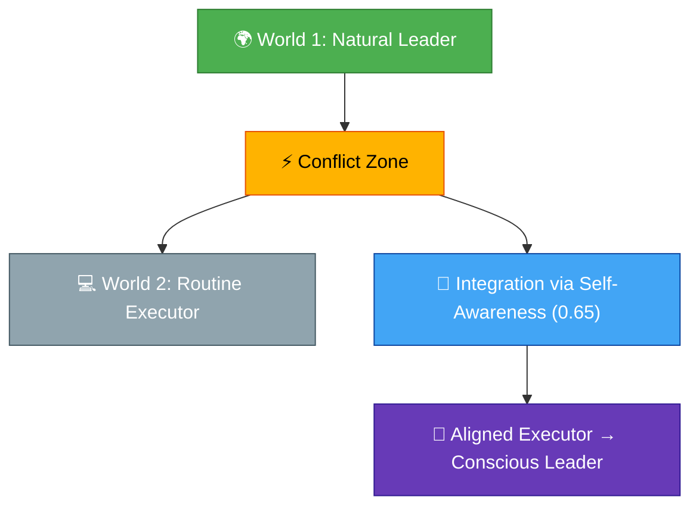
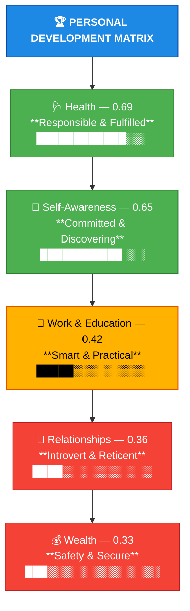

# 🧩 An Analytical Deconstruction of the Personal Assessment Test for Hrithik Singh

## 🧭 Executive Summary: Reconciling the “Two Worlds” of the Executor

This report presents a **deep analytical interpretation** of the *Personal Assessment Test* completed by **Hrithik Singh (Age 21)**, who is identified with the **"EXECUTOR" archetype**.

At first glance, the assessment may appear contradictory — balancing ambition and caution, leadership and introversion. However, these contradictions are **diagnostic, not erroneous**. They expose the core psychological and behavioral tension between:

| Internal World (Being) | External World (Doing) |
|-------------------------|------------------------|
| **Natural Leader** | **Routine Executor** |
| **Adventurous & Ambitious** | **Cautious & Practical** |
| **Expressive** | **Reticent & Introverted** |

> **Central Finding:**  
> Hrithik lives in “two worlds” — one with himself, and one with the rest. These worlds are *opposite yet interdependent*.  
> The goal is not to eliminate this duality but to **integrate** it.

---

## 🧩 Part 1: Deconstructing the Assessment Framework

### 1.1 Understanding the Bell-Curve Model

The test does **not** operate on a straight grading scale.  
Instead, it follows a **Bell Curve**, where **0.5–0.7** represents the *“Peak Functionality Zone”* (Existential & Evolutionary state).

| Score Range | Interpretation | Psychological State |
|--------------|----------------|----------------------|
| **0.81–1.0** | Visionary | Idealistic / Transcendent |
| **0.61–0.8** | Peak | Existential & Evolutionary |
| **0.41–0.6** | Practical | Transition & Adaptation |
| **0.0–0.4** | Obsolete | Stagnation / Old Patterns |

**Hrithik’s Position:**
- **Health (0.69)** and **Self-Awareness (0.65)** are at the *Peak Zone*.  
- **Relationships (0.36)**, **Wealth (0.33)**, and **Work/Education (0.42)** fall in the *Obsolescence Zone*.  

### 1.2 The Executor Archetype

| Attribute | Definition |
|------------|-------------|
| **Archetype** | Executor / Doer |
| **Language of Being** | Execution |
| **Behavioral Expression** | Routine & Regular |
| **Aptitude Identified** | Coding |
| **Challenge** | Executing the wrong mission (misaligned with inner self) |

> The **Executor** archetype’s question is not *“What can I imagine?”* but *“What am I executing?”*

---

## ⚖️ Part 2: Diagnosing the “Two Worlds” Schism

The assessment reveals a structured conflict between **World 1 (Internal Identity)** and **World 2 (External Function)**.

### Table 1: The “Two Worlds” Matrix

| Domain | **World 1: Internal Identity** | **World 2: Current Function (Scores & Labels)** |
|--------|--------------------------------|------------------------------------------------|
| **Career & Work** | Natural Leader; Ambitious; Inspires others | Score: 0.42 → “Smart & Practical” Aptitude: Coding Behavior: Routine & Regular Career: Logistics / Operations |
| **Wealth & Finance** | Adventurous; Risk-taker; Desires richness | Score: 0.33 → “Safety & Secure” Mindset: “A bird in hand is worth two in a bush” |
| **Social & Relationships** | Charming; Humanitarian; Emotionally aware | Score: 0.36 → “Introvert & Reticent” Tendency: Withdraws from conflict, struggles to articulate |

---

### 2.1 The Career Paradox: A Leader Executing a Routine

| Conflict | Description |
|-----------|--------------|
| **World 1** | Sees himself as a *Natural Leader*, destined to influence and inspire. |
| **World 2** | Behaves as a *Routine Technician*, following systems and coding patterns. |

> **Diagnostic Insight:**  
> His 0.42 “Smart & Practical” score reflects a leader **executing the wrong blueprint**.  
> The aptitude “Coding” is a *tool*, not an *identity*.

---

### 2.2 The Wealth Paradox: Gamble vs. Safety

- **Internal Drive:** “Not careful with money,” drawn to *risk and ambition.*  
- **External Behavior:** 0.33 score labeled *“Safety & Secure”* — risk-averse and conservative.  

| Internal Impulse | External Condition | Effect |
|------------------|--------------------|--------|
| Desire to gamble & grow | Financial caution due to student status | Creates inner frustration and energy loss |

---

### 2.3 The Social Paradox: The Charming Introvert

- The “charm” is performative — *a mask of the Leader*.  
- The “introversion” is authentic — *the reality of the Executor.*

| Behavior | Interpretation |
|-----------|----------------|
| Uses charm to socialize | A coping strategy, not authenticity |
| Withdraws from conflict | Self-protective retreat |
| Writes to express | Recommended therapeutic habit |

---

## 🌱 Part 3: Leveraging Foundational Strengths

Despite conflict, Hrithik possesses *two strengths* in the **Peak Zone** (0.61–0.8):

| Domain | Score | Descriptor | Transformation Role |
|---------|--------|-------------|----------------------|
| **Self-Awareness** | 0.65 | *Committed & Discovering* | Engine of Change |
| **Health** | 0.69 | *Responsible & Fulfilled* | Model for Synthesis |

### 3.1 Self-Awareness (0.65)
> “You have a deep yearning to know more about yourself... You are a student of life.”

This awareness is his **greatest tool** for integrating both worlds.

### 3.2 Health (0.69)
> “You balance routine and adventure.”

He has already achieved harmony in this domain — proving integration is *possible*.

---

## 🧠 Part 4: Prescriptive Strategy for Integration

### 4.1 Hrithik’s Average Score (0.49): On the Edge of the Peak

| Zone | Range | Hrithik’s Score |
|-------|-------|----------------|
| **Existential & Evolutionary** | 0.5 – 0.7 | ❌ 0.49 *(Just below peak)* |

The report recommends the **“Curriculum for Life (Self-Study)”**, perfectly aligned to:
- His **Introverted** style  
- His **Self-Awareness (0.65)** engine  
- His **Executor** nature (structured action)

---

### 4.2 The Prescribed Texts: Precision Tools

| Book | Purpose | Alignment with Diagnosis |
|------|----------|--------------------------|
| **Who Moved My Cheese** by Spencer Johnson | Teaches adaptation and courage to pursue new “cheese” (opportunities) | Helps abandon obsolete patterns (Routine, Safety) |
| **Atomic Habits** by James Clear | Framework for behavioral integration | Reconnects *Executor habits* with *Leader intentions* |

---

### 💡 Application Strategy

| Domain | Issue | New Habit / Action |
|--------|--------|--------------------|
| **Wealth (0.33)** | Impulse vs. Safety conflict | Build daily tracking & mindful spending habit |
| **Relationships (0.36)** | Reticence & withdrawal | Journal and articulate emotions daily |
| **Work (0.42)** | Routine misalignment | Dedicate daily time to leadership development alongside coding |

---

## 🧩 Conclusion: Synthesis and Call to Action

The *Personal Assessment Test* for **Hrithik Singh** is not a personality label — it’s a **diagnostic map** of transformation.

| Summary | Insight |
|----------|----------|
| **Core Diagnosis** | Conflict between *World 1 (Leader)* and *World 2 (Executor)* |
| **Obsolete Areas** | Work (0.42), Relationships (0.36), Wealth (0.33) |
| **Peak Strengths** | Self-Awareness (0.65), Health (0.69) |
| **Archetype Power** | Executor = Builder / Integrator |
| **Primary Task** | Align *Execution* with *Identity* |

> **Action Statement:**  
> Hrithik’s “Executor” nature is not a limitation. It is his **superpower**.  
> By executing *aligned actions* (Atomic Habits), he can integrate his *two worlds* and evolve from a *Routine Doer* to a *Conscious Leader.*

---

## 🗂️ Visual Summary: “The Two Worlds” Alignment Map

## 🌐 Wheel of Life Overview – Hrithik Singh

