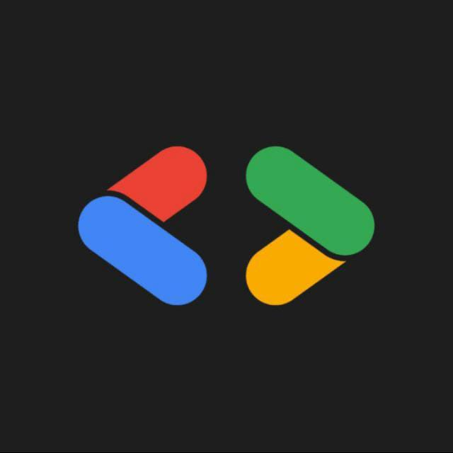

  

# CertChain - Decentralized Certificate Verification

### Powered by Google Developer Group MGMCET

---

## Contribution Guidelines

**CertChain** is a blockchain-based certificate verification system that leverages **Ethereum smart contracts** to create an **immutable registry** for academic and professional certificates. We welcome contributions from developers who want to help build a more transparent and secure credential verification system.

---

## How to Get Started

| Step | Action | Command |
|------|--------|---------|
| a | Fork the repository | Click "Fork" on GitHub |
| b | Clone the repository | `git clone https://github.com/YOUR_USERNAME/certchain.git` |
| c | Create a branch | `git checkout -b feature/your-feature-name` |
| d | Make your changes | — |
| e | Commit your changes | `git commit -m "Add: description of changes"` |
| f | Push your changes | `git push origin feature/your-feature-name` |
| g | Submit a pull request | Open PR on GitHub |

---

## Requirement of Pull Request

| Requirement | Description |
|-------------|-------------|
| a. Solution Description | Clear explanation of what your code does |
| b. Libraries/Packages Used | List all dependencies added |
| c. Video Link | Google Drive link demonstrating the working feature |
| d. Issue Number | Reference the issue (e.g., #2) |

---

## Open Innovation Section

Open Innovation allows contributors to propose and implement their own ideas to improve CertChain. If you have a feature idea that is not listed in the existing issues, you can create your own issue and work on it.

### How to Get Started on It

| Step | Action |
|------|--------|
| 1 | Find a feature you want to build |
| 2 | Create an issue describing the feature |
| 3 | Solve the issue |
| 4 | Send the pull request |

---

## Rules and Protocol

| Rule | Description |
|------|-------------|
| 1 | Must create a new branch to implement the feature |
| 2 | No changes in existing contracts. Create new contract in `contracts/` folder |
| 3 | Follow existing folder structure |

---

## NOTE

The **first contributor** solving the issue with proper working code will get the certificate.

In **Open Innovation**, the one who created the issue will get the certificate only if the solution is working perfectly.

---

**Maintained by Google Developer Group MGMCET**

